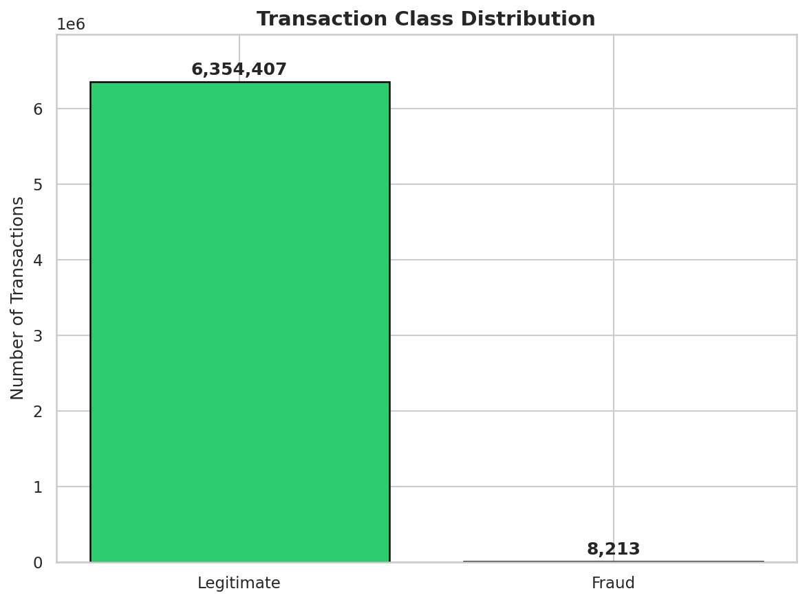
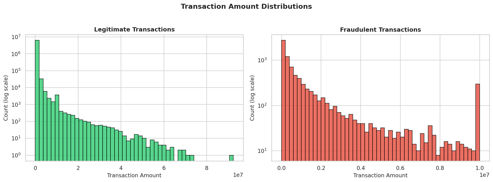
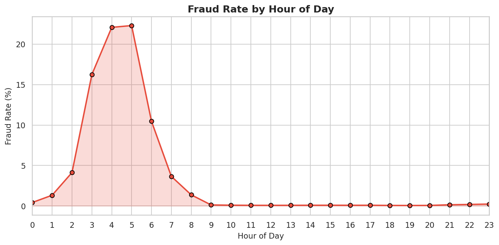
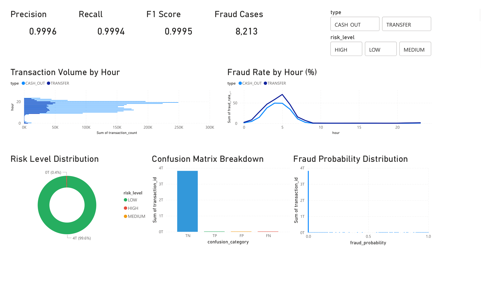

# Financial Transaction Fraud Detection

Financial fraud costs institutions billions annually, yet rule-based detection systems miss most cases. In this dataset, the built-in `isFlaggedFraud` system catches only 16 of 8,213 actual fraud cases—a 0.2% recall rate. This project builds a machine learning pipeline that detects 99.6% of fraud using engineered balance-anomaly features.

## Key Findings



Only 0.13% of transactions are fraudulent—any model predicting "not fraud" for everything achieves 99.87% accuracy while catching zero fraud.



Fraudulent transactions skew toward higher amounts as fraudsters maximise extraction before accounts are frozen.



No strong hourly pattern in this simulated dataset, though real-world data would likely show off-hours spikes.

## Dashboard

I built an interactive Power BI dashboard on the model's predictions to visualise fraud patterns, risk levels, and model performance at a glance.



## Approach

1. Explored PaySim dataset (6.3M transactions) and confirmed fraud only occurs in TRANSFER/CASH_OUT types.
2. Engineered seven features capturing balance anomalies: origin/destination balance errors, account-emptied flags, amount-to-balance ratio, and transaction type indicators. These work because fraudulent transfers create arithmetic discrepancies where the origin account loses more than the destination receives.
3. Trained four models (Logistic Regression, Random Forest, XGBoost with class weighting, XGBoost with SMOTE) using precision/recall/F1 instead of accuracy.
4. Selected Random Forest based on F1-score and applied 0.3 probability threshold to optimise fraud detection.
5. Deployed as FastAPI endpoint with Docker containerisation.

## Model Performance

| Model | Precision | Recall | F1 |
|-------|-----------|--------|-----|
| Logistic Regression | 0.10 | 0.93 | 0.18 |
| Random Forest | 1.00 | 1.00 | 1.00 |
| XGBoost (scale_pos_weight) | 0.84 | 1.00 | 0.91 |
| XGBoost (SMOTE) | 0.96 | 1.00 | 0.98 |

***Note: Near-perfect scores reflect PaySim's synthetic data patterns rather than expected real-world performance. See the modelling notebook for a full discussion.***

## Run It Yourself

```bash
git clone https://github.com/rj694/fraud-detection.git
cd fraud-detection

python -m venv venv
source venv/bin/activate  # Windows: venv\Scripts\activate
pip install -r requirements.txt
```

Download [PaySim dataset](https://www.kaggle.com/datasets/ealaxi/paysim1) and place `PS_20174392719_1491204439457_log.csv` in `data/`.

```bash
jupyter lab  # Run notebooks 01-03 in order

docker build -t fraud-detection .
docker run -p 8000:8000 fraud-detection
# API docs at http://localhost:8000/docs
```

## What I'd Do Next

- **Validate on real-world transaction data** — synthetic PaySim patterns are too clean; real fraud is messier and would likely show significant performance drops
- **Add monitoring for data/prediction drift** — detect when incoming transactions diverge from training distribution
- **Build feedback loop for retraining** — incorporate confirmed fraud labels from investigations to improve the model over time
- **Explore graph-based features** — transaction networks between accounts could reveal coordinated fraud rings
- **Add hyperparameter tuning with cross-validation and unit tests** for the feature engineering and prediction pipeline

## Tools Used

Python, pandas, scikit-learn, XGBoost, FastAPI, Docker, Power BI
